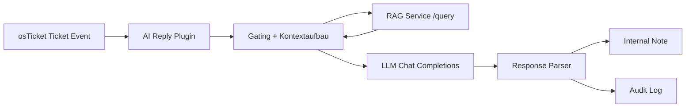

# osTicket Abgabeprojekt: AI Reply Assistant + Local RAG (Ollama/LlamaIndex)

Dieses Repository ist ein **Vollrepo auf Basis von osTicket** mit folgenden projektspezifischen Erweiterungen:

- AI Reply Assistant Plugin mit lokalem LLM-Endpunkt (Ollama/OpenAI-kompatibel)
- Lokaler RAG-Service (FastAPI + LlamaIndex + Ollama Embeddings)
- Idempotenter Knowledgebase-Seeder (direkter DB-Zugriff)
- Multimodale Ticket-Verarbeitung (Text + Bildanhaenge)

Die Dokumentation ist auf eine **Abgabe/Pruefung** ausgerichtet: Eine Pruefperson soll Architektur, Betrieb und Tests in 10 Minuten verstehen und in 30 bis 60 Minuten reproduzieren koennen.

## Schnellstart

1. Voraussetzungen: Linux, Apache/Nginx, PHP, MySQL/MariaDB, Python 3, Ollama.
2. osTicket bereitstellen (Runtime-Root: `/var/www/osticket`).
3. Plugin im osTicket Plugin-Verzeichnis aktivieren.
4. RAG-Service via systemd oder `uvicorn` starten.
5. Seeder ausfuehren (`--apply` oder `--dry-run`).
6. End-to-End testen (Health, Query, AI Draft in Ticketansicht).

Detaillierte Schritte: `docs/07_Deployment_and_Operations.md`.

## Ziel-Laufzeitpfad und Ports

Standard fuer diese Abgabe:

- osTicket Runtime-Root: `/var/www/osticket`
- Repo-Arbeitsverzeichnis: `/osTicket`

| Komponente | Bind/Port | Zweck | Externe Erreichbarkeit |
|---|---|---|---|
| Apache/osTicket | `0.0.0.0:80` und optional `0.0.0.0:443` | Web UI und API des Ticket-Systems | Ja (z. B. ueber Cloudflare Tunnel) |
| RAG Service | `127.0.0.1:8099` | Retrieval fuer FAQ/Kategorien | Nein (nur lokal) |
| Ollama | `127.0.0.1:11434` | Chat + Embeddings lokal | Nein (nur lokal) |
| MySQL/MariaDB | `127.0.0.1:3306` oder intern | Persistente osTicket-Daten | Nein (nur intern) |

Cloudflare Tunnel sollte nur den Webdienst exponieren. RAG, Ollama und DB bleiben auf Loopback/intern.

## Aufsetzen (Schritt fuer Schritt)

Die folgenden Schritte bilden den vollstaendigen Installationsablauf fuer Code, Datenbank, LlamaIndex und RAG-Service.

### 1) Voraussetzungen pruefen

```bash
php -v
python3 --version
mysql --version
ollama --version
```

### 2) Datenbank anlegen (MySQL/MariaDB)

Beispiel fuer eine neue Datenbank `osticket` mit Prefix `ost_`:

```bash
sudo mysql -e "CREATE DATABASE IF NOT EXISTS osticket CHARACTER SET utf8mb4 COLLATE utf8mb4_unicode_ci;"
sudo mysql -e "CREATE USER IF NOT EXISTS 'osticket'@'localhost' IDENTIFIED BY '<DB_PASSWORD>';"
sudo mysql -e "GRANT ALL PRIVILEGES ON osticket.* TO 'osticket'@'localhost'; FLUSH PRIVILEGES;"
```

Falls bereits eine bestehende DB verwendet wird, kann dieser Schritt entfallen.

### 3) osTicket bereitstellen und DB-Verbindung konfigurieren

Beispiel fuer Deploy aus dem Vollrepo:

```bash
cd <REPO_ROOT>
php manage.php deploy --setup <OSTICKET_ROOT>
```

Danach in `<OSTICKET_ROOT>/include/ost-config.php` sicherstellen:

- `DBHOST`, `DBNAME`, `DBUSER`, `DBPASS`
- `TABLE_PREFIX` (z. B. `ost_`)

Der RAG-Service und der Seeder lesen diese Werte aus der osTicket-Config.

### 4) Python-Umgebung + LlamaIndex-Stack installieren

```bash
sudo apt update
sudo apt install -y python3-venv
sudo mkdir -p /opt/osticket-kb-rag
sudo python3 -m venv /opt/osticket-kb-rag/.venv
sudo /opt/osticket-kb-rag/.venv/bin/python -m pip install --upgrade pip
sudo /opt/osticket-kb-rag/.venv/bin/pip install -r <REPO_ROOT>/tools/kb_rag_service/requirements.txt
```

Diese Requirements enthalten u. a.:

- `llama-index-core`
- `llama-index-embeddings-ollama`
- `fastapi`
- `uvicorn`
- `pymysql`

Import-Test:

```bash
/opt/osticket-kb-rag/.venv/bin/python -c "import fastapi, uvicorn, pymysql; from llama_index.core import VectorStoreIndex; from llama_index.embeddings.ollama import OllamaEmbedding; print('OK')"
```

### 5) Ollama-Modelle vorbereiten

```bash
ollama pull gemma3:4b
ollama pull embeddinggemma:latest
ollama list
```

### 6) RAG-Service via systemd installieren

```bash
sudo install -m 644 <REPO_ROOT>/tools/kb_rag_service/systemd/osticket-kb-rag.service /etc/systemd/system/osticket-kb-rag.service
sudo sed -i 's#^WorkingDirectory=.*#WorkingDirectory=<OSTICKET_ROOT>/tools/kb_rag_service#' /etc/systemd/system/osticket-kb-rag.service
sudo sed -i 's#^ExecStart=.*#ExecStart=/opt/osticket-kb-rag/.venv/bin/python -m uvicorn app:app --host 127.0.0.1 --port 8099#' /etc/systemd/system/osticket-kb-rag.service
sudo systemctl daemon-reload
sudo systemctl enable --now osticket-kb-rag.service
sudo systemctl status osticket-kb-rag.service --no-pager
```

### 7) KB-Daten einspielen (Seeder oder Dump)

Option A (empfohlen, idempotent):

```bash
cd <REPO_ROOT>
python3 seed_osticket_kb.py --dry-run --root <OSTICKET_ROOT>
python3 seed_osticket_kb.py --apply --root <OSTICKET_ROOT>
```

Option B (wenn Snapshot-Dump vorhanden):

```bash
mysql -h <DB_HOST> -u <DB_USER> -p <DB_NAME> < kb_export.sql
```

### 8) Plugin in osTicket aktivieren

In osTicket Admin:

1. `Manage -> Plugins -> Add New Plugin -> AI Reply Assistant`
2. Plugin aktivieren und Instanz anlegen
3. Mindestens diese Werte setzen:
   - `llm_base_url`: `http://127.0.0.1:11434/v1`
   - `llm_auth_enabled`: `OFF`
   - `llm_model`: `gemma3:4b`
   - `rag_enabled`: `ON`
   - `rag_service_url`: `http://127.0.0.1:8099`
   - `rag_fail_mode`: `strict`
   - `attachment_policy`: `analyze_images` (optional, fuer Bildanalyse)

### 9) Betriebscheck

```bash
curl -sS http://127.0.0.1:8099/health
curl -sS -X POST http://127.0.0.1:8099/reindex
curl -sS -X POST http://127.0.0.1:8099/query -H 'Content-Type: application/json' -d '{"subject":"Outlook startet nicht","latest_message":"haengt beim Start","top_k":3}'
```

Soll:

- `health.status` ist `ok`
- `doc_count` ist groesser als `0`
- `query.results` enthaelt Treffer mit `reference_url`

### 10) AI Draft im Ticket pruefen

1. Ticket im Agent-Panel oeffnen
2. `AI Draft` klicken
3. Ergebnis als Internal Note pruefen

Wenn Fehler auftreten: `docs/09_Troubleshooting.md`.

## Was ist custom?

Die wesentlichen projektspezifischen Komponenten sind:

- Plugin: `include/plugins/ai-reply-assistant/`
- RAG-Service: `tools/kb_rag_service/app.py`
- Seeder: `seed_osticket_kb.py`
- Demo-Dataset: `kb_demo.json`
- Seeder-Runbook: `README_SEED_KB.md`

Kern-Einstiegspunkte im Code:

- Plugin Bootstrap und AJAX-Hook: `include/plugins/ai-reply-assistant/class.AiReplyPlugin.php:53`
- Ticket-Pipeline: `include/plugins/ai-reply-assistant/classes/EventRouter.php:383`
- Prompt/Attachment-Aufbau: `include/plugins/ai-reply-assistant/classes/ContextBuilder.php:77`
- RAG-Hit-Format + Quellen-URL: `include/plugins/ai-reply-assistant/classes/KbRetriever.php:204`
- LLM-Endpunkt-Aufloesung + Timeout-Handling: `include/plugins/ai-reply-assistant/classes/OpenAiClient.php:57`
- RAG-Health-Statusmodell: `tools/kb_rag_service/app.py:817`
- Seeder Hauptablauf: `seed_osticket_kb.py:904`

## Dokumentationsindex

- `docs/00_Submission_Overview.md`
- `docs/01_Repository_Structure.md`
- `docs/02_Architecture_and_Dataflow.md`
- `docs/03_Plugin_Reference.md`
- `docs/04_RAG_Service_Reference.md`
- `docs/05_KB_Seeder_Reference.md`
- `docs/06_Config_and_Env_Matrix.md`
- `docs/07_Deployment_and_Operations.md`
- `docs/08_Testplan_and_Acceptance.md`
- `docs/09_Troubleshooting.md`
- `docs/10_Security_Privacy_Limits.md`
- `docs/11_Known_Issues_and_Roadmap.md`
- `docs/12_Database_Handover_Guide.md`
- `docs/REFERENCES.md`

## Architektur auf einen Blick



Detaillierte Flows: `docs/02_Architecture_and_Dataflow.md`.

## Abgabe-Checkliste

- [ ] Alle Dokumente unter `docs/` vorhanden
- [ ] Beispiele enthalten nur anonymisierte Infrastrukturwerte
- [ ] RAG Health (`/health`) liefert `ok` mit `doc_count > 0`
- [ ] AI Draft erzeugt Internal Note (kein Direktversand)
- [ ] Testmatrix in `docs/08_Testplan_and_Acceptance.md` ausgefuellt
- [ ] Bekannte Grenzen und Risiken dokumentiert (`docs/11_Known_Issues_and_Roadmap.md`)

## Lizenz

- Lizenzhinweise: `LICENSE.txt`
- Custom-Komponenten in diesem Repo sind fuer die Projektabgabe dokumentiert.

## Website-Referenzen

### AI Reply Assistant

- Integrationsdokumentation im Projekt: `include/plugins/ai-reply-assistant/README_RAG.md`
- Plugin-Konfiguration im Projekt: `include/plugins/ai-reply-assistant/config.php`

### osTicket

- Website: https://osticket.com
- Dokumentation: https://docs.osticket.com

### LlamaIndex

- Dokumentation: https://docs.llamaindex.ai/en/stable/

## Was wird bei `git push` nicht hochgeladen?

1. **LlamaIndex Vektorraum/Indexdaten** aus dem laufenden Service werden aktuell nicht persistent gespeichert.
2. **SQL-Datenbankinhalte** (osTicket Daten, FAQs, Tickets) werden nicht durch Git versioniert.

Technischer Hintergrund:

- Der RAG-Service baut den Index zur Laufzeit neu auf (`VectorStoreIndex` in `tools/kb_rag_service/app.py`), statt ihn als Datei im Repo zu persistieren.
- Die SQL-Daten liegen in MySQL/MariaDB außerhalb des Git-Repositories.

Fuer die Abgabe von DB-Inhalten ist ein separater Dump (z. B. `mysqldump`) als Datei erforderlich.

Allgemeine Datenbank-Einbindungsanleitung: `docs/12_Database_Handover_Guide.md`.
