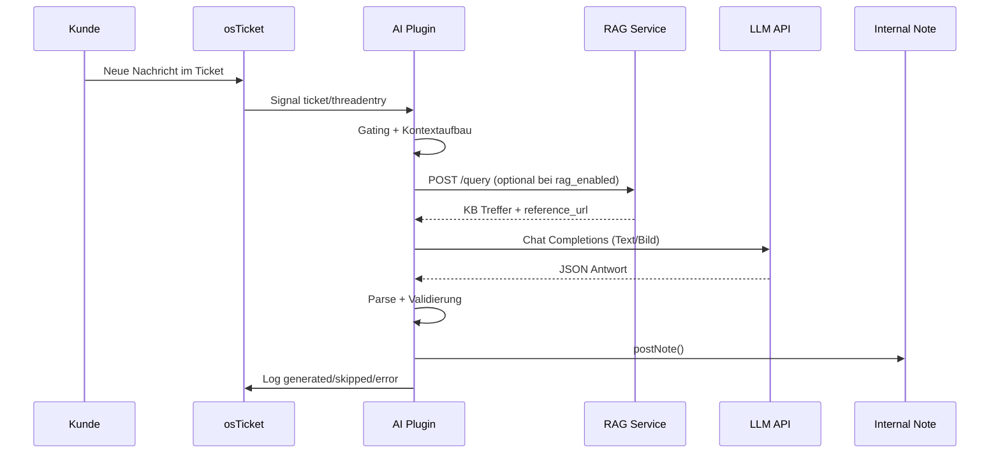
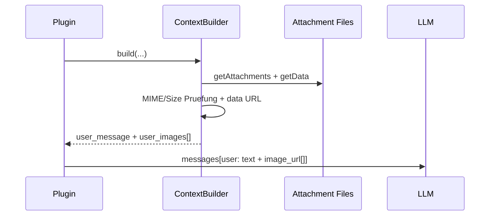
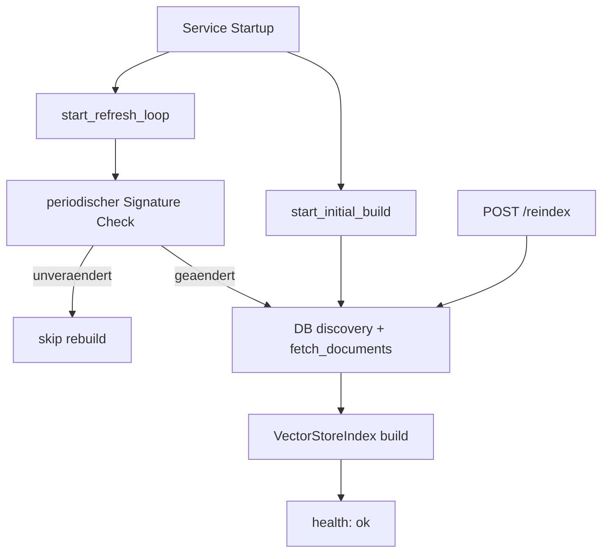

# 02 Architecture and Dataflow

## Komponenten

| Komponente | Verantwortung | Referenz |
|---|---|---|
| Plugin Bootstrap | Registriert Signal- und AJAX-Hooks | `include/plugins/ai-reply-assistant/class.AiReplyPlugin.php:53` |
| EventRouter | Orchestriert End-to-End Pipeline | `include/plugins/ai-reply-assistant/classes/EventRouter.php:383` |
| GatingLogic | Zulassen/Blockieren pro Ticket | `include/plugins/ai-reply-assistant/classes/GatingLogic.php:46` |
| ContextBuilder | Prompt + Kontext + Bildanhaenge | `include/plugins/ai-reply-assistant/classes/ContextBuilder.php:59` |
| KbRetriever | RAG/FAQ/Canned Retrieval + Quellen-URL | `include/plugins/ai-reply-assistant/classes/KbRetriever.php:204` |
| OpenAiClient | Chat Completions Request/Retry/Timeout | `include/plugins/ai-reply-assistant/classes/OpenAiClient.php:57` |
| ResponseParser | Parse/validiere JSON-Antwort | `include/plugins/ai-reply-assistant/classes/ResponseParser.php` |
| NoteWriter | Schreibt Internal Note | `include/plugins/ai-reply-assistant/classes/NoteWriter.php:42` |
| LogWriter | Audit-Log fuer generated/skipped/error | `include/plugins/ai-reply-assistant/classes/LogWriter.php:43` |
| RAG Service | Embedding-Index + `/health` `/query` `/reindex` | `tools/kb_rag_service/app.py:859` |

## End-to-End Hauptfluss (Ticket -> AI Draft)

Zentrale Ablaufstelle: `include/plugins/ai-reply-assistant/classes/EventRouter.php:383`.

## Multimodal-Fluss (Text + Bilder)

Relevante Implementierung:

- Attachment Policy und Bildlimit: `include/plugins/ai-reply-assistant/classes/ContextBuilder.php:339`
- Unterstuetzte MIME Typen: `include/plugins/ai-reply-assistant/classes/ContextBuilder.php:555`
- Multimodaler Payload: `include/plugins/ai-reply-assistant/classes/OpenAiClient.php:235`

## RAG-Index-Lifecycle

Implementierungsstellen:

- Startup: `tools/kb_rag_service/app.py:844`
- Initial Build: `tools/kb_rag_service/app.py:803`
- Refresh Loop: `tools/kb_rag_service/app.py:790`
- Health Status (`warming_up|ok|error`): `tools/kb_rag_service/app.py:820`

## Retrieval-Inhalt und Quellen

Der RAG-Service indexiert:

1. FAQ-Dokumente (`source_type=faq`)
2. Standalone Category-Guidance Dokumente (`source_type=category`)

Siehe:

- FAQ Metadata inkl. `faq_url/category_url/reference_url`: `tools/kb_rag_service/app.py:631`
- Kategorie-Guidance als eigene Dokumente: `tools/kb_rag_service/app.py:644`

Im Plugin werden Treffer in Prompt-Kontext serialisiert, inklusive `Reference URL` Zeilen.
Siehe `include/plugins/ai-reply-assistant/classes/KbRetriever.php:220` und `include/plugins/ai-reply-assistant/classes/KbRetriever.php:259`.

## Strict Fail-Verhalten

Wenn RAG aktiviert ist und der Service fehlschlaegt, wird im Strict-Mode die Draft-Erstellung abgebrochen.

- RAG Exception: `include/plugins/ai-reply-assistant/classes/RagServiceClient.php:123`
- Fehlerbehandlung mit `rag_error`: `include/plugins/ai-reply-assistant/classes/EventRouter.php:483`

## Prompt-Regel fuer Quellenangaben

Der Systemprompt erzwingt, dass `Reference URL` Werte als `Sources:` Abschnitt am Ende von `reply_body` erscheinen.
Siehe `include/plugins/ai-reply-assistant/classes/ContextBuilder.php:98`.
